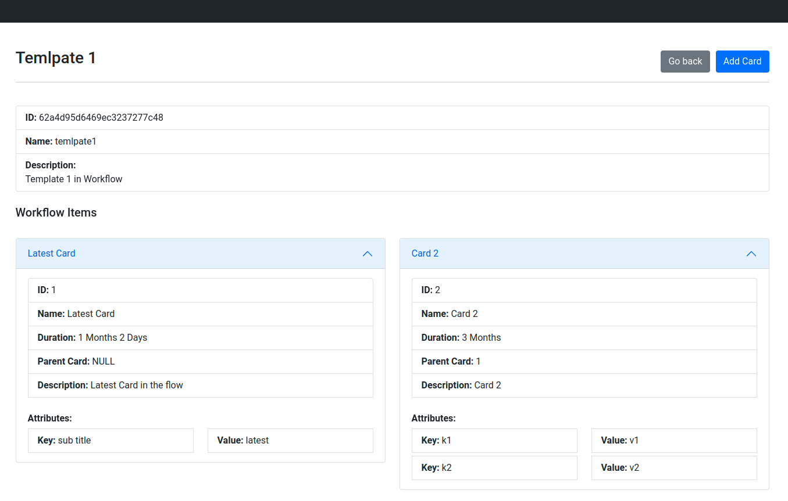

# Template System Frontend

### Setup
1. Hit ```npm install``` to install NPM dependencies.
2. Just RUN ```npm start``` and it will be up on PORT 3000.

### Home Page
        

### Templates page


### Template page


### Add Card Page

